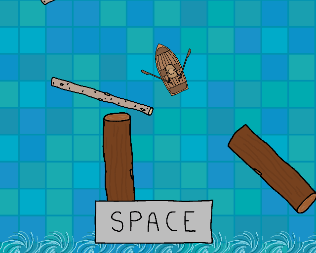

# row-with-the-flow

A 2D game created by @thebaristas for the 2022 [Ludum Dare 50](https://ldjam.com/) game jam based on the theme "Delay the Inevitable".

## Try it out

A WebGL version of the game is available at: https://thebaristas.github.io/row-with-the-flow/.

You can also build the game yourself. To do this, clone the repository and open the root directory in Unity at version `2021.2.18f1`.

## The game

### Controls

| Key     | Action            |
| ------- | ----------------- |
| `Space` | Row (if on beat!) |
| `A`/`←` | Turn left         |
| `D`/`→` | Turn right        |

## Built with

- [Unity](https://unity.com/) - Game Engine
- [Gimp](https://www.gimp.org/) - Artwork
- [Logic Pro](https://www.apple.com/logic-pro/) - Music
- [GitHub Pages](https://pages.github.com/) - Static Hosting

## License

[MIT license](./LICENSE)
